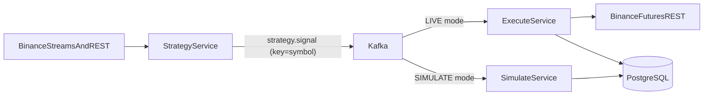

# Implementation Spec (v1)

## 1) Scope

This document consolidates all approved decisions from `question.md` through `question8.md` and `peak-trough-spec.md` into an implementation-ready specification for v1.

### In scope (v1)
- Monorepo microservices architecture.
- Live and simulate execution paths (mutually exclusive by global mode).
- Kafka-based event flow with JSON contracts.
- PostgreSQL persistence with schema-per-service ownership.
- Flyway migration management.
- Binance Futures **mainnet** integration for live mode.

### Out of scope (v1)
- Multi-symbol deployment in one runtime.
- Mandatory DLQ/retry orchestration.
- Kubernetes deployment.

---

## 2) Architecture and Runtime Model

### 2.1 Services and infrastructure
- Application services:
  - `strategy-service`
  - `execute-service`
  - `simulate-service`
- Infrastructure containers in Docker Compose:
  - Kafka (+ broker dependencies as needed)
  - PostgreSQL

### 2.2 Monorepo and deployment
- Monorepo is required for v1.
- Each application service is built as an independent Docker image.
- Docker Compose orchestrates all services on a single machine.

### 2.3 Global mode switch
- `SIMULATE` (default): strategy signals are consumed by `simulate-service`.
- `LIVE`: strategy signals are consumed by `execute-service`.
- Only one mode is active at a time.

### 2.3.1 Backtest vs realtime vs execution mode (normative)

`BACKTEST_ENABLED` (strategy-service) and `TRADING_MODE` (stack-wide) interact as follows:

| Strategy data path | `BACKTEST_ENABLED` | Allowed `TRADING_MODE` |
|---|---|---|
| Historical replay (backtest) | `true` | **`SIMULATE` only** |
| Realtime market data (streaming) | `false` | `SIMULATE` or `LIVE` |

**Rule:** When backtest is enabled, the deployment **must** use `TRADING_MODE=SIMULATE`. Live execution **must not** consume Kafka signals produced from historical replay (wrong latency semantics and risk profile). Services **fail fast at startup** if `BACKTEST_ENABLED=true` together with `TRADING_MODE=LIVE`.

When backtest is off, realtime strategy signals may feed either paper trading (`SIMULATE`) or live orders (`LIVE`) as today.

### 2.4 End-to-end data flow



---

## 3) Service Boundaries and Ownership Matrix

| Service | Core responsibility | Kafka ownership | DB schema ownership |
|---|---|---|---|
| `strategy-service` | Market data ingestion, candle maintenance, peak/trough scan, signal generation, backtest standalone mode | Produces strategy signals and market-derived events | `strategy` (optional internal state; no trade ledger ownership) |
| `execute-service` | Live risk checks, live sizing, order placement, bracket lifecycle, risk pause/unblock | Consumes strategy signal in LIVE, produces execution/order lifecycle events | `execute` (orders, positions, fills for live, risk bucket state, live audit) |
| `simulate-service` | Paper sizing, paper order simulation, fill checks, TP/SL lifecycle, liquidation rules | Consumes strategy signal in SIMULATE, produces paper lifecycle events | `simulate` (paper account snapshot, paper orders/positions/fills, paper audit) |

### 3.1 Backtest boundary
- Backtest runs inside `strategy-service` and can run standalone (profile/CLI mode).
- Backtest is excluded from realtime latency SLO enforcement.
- Backtest emission to Kafka is **only** valid when the stack is in `TRADING_MODE=SIMULATE` (see section 2.3.1); operators set the same `BACKTEST_ENABLED` and `TRADING_MODE` across Compose services.
- For each OHLC step in backtest, `strategy-service` runs the strategy engine, then publishes an ordered **replay feed** to Kafka (`simulate-replay` topic): `MARK` rows (one per OHLC price) so `simulate-service` can update mark and evaluate TP/SL/liquidation, plus `SIGNAL` rows when the engine fires. Live streaming continues to use `strategy.signal` only.

---

## 4) Strategy and Market Data Rules (Normative)

### 4.1 Peak/trough detection
- Canonical algorithm source: `peak-trough-spec.md`.
- Use only confirmed swings in live mode (no look-ahead).
- Default parameters: `N=500`, `K=2`, with configured limits already defined in prior specs.

### 4.2 Drawdown and entry gates
- `avg_top` and `avg_bottom` definitions are as locked in prior documents.
- Gate 1: `|avg_top - avg_bottom| <= 0.001`.
- Gate 2: `max(avg_top, avg_bottom) > 4 * taker_fee`.
- `taker_fee` must be configurable (env/config), default to current spec value.

### 4.3 Candle and trigger cadence
- Trigger strategy logic every ~2 seconds from mark price updates.
- Kline history bootstrap by REST once (or reconnect), then maintain via WS kline stream.
- No steady-state REST polling for klines.

---

## 5) Risk and Execution Rules (Live)

### 5.1 Risk bucket
- Rolling 24h bucket (realized PnL only).
- Bucket opening equity is snapshotted at bucket start.
- On bucket rollover: new opening equity snapshot; realized loss resets to `0`.

### 5.2 Max loss enforcement
- If cumulative realized loss reaches `20%` of opening equity, pause new orders.
- Trading remains halted until authenticated manual unblock/reset endpoint is invoked.

### 5.3 Latency policy (end-to-end: market tick -> order submit)
- `> 1s`: warning emitted, execution still allowed.
- `>= 5s`: warning emitted and execution is blocked for that path.
- Excludes backtest/offline replay path.

### 5.4 Binance live order path
- Use Binance Futures REST for order placement.
- Bracket semantics required: TP+SL on one position with cancel-on-fill sibling behavior.
- Live price reference for TP/SL monitoring and distance logic: **mark price**.

---

## 6) Simulate Rules (Paper)

- Fill model: fill at last pushed mark price.
- TP/SL distance and trigger checks use **mark price** (aligned with live reference family).
- Simplified liquidation model as previously approved.
- After liquidation: account frozen until reset/restart policy is applied.
- Stats classification rule remains mutually exclusive (win/lose/liquidation handling per prior spec).

---

## 7) Kafka Contracts and Versioning

### 7.1 Naming and partitioning
- Topic naming uses base names with configurable symbol prefix, e.g. `BTCUSDT.strategy.signal`.
- Kafka key must be `symbol` (e.g. `BTCUSDT`) for partition consistency.

### 7.2 Contract strategy
- Shared contract module in monorepo defines DTOs and serialization rules.
- JSON payload format.
- Contract versioning uses explicit `schemaVersion` field in each event.
- Backward-compatible additions only in v1 (`optional` field additions allowed).

### 7.3 Minimum required events

#### `simulate.replay` (backtest only, ordered)

Multiplexed JSON rows on topic `TOPIC_SIMULATE_REPLAY` (e.g. `BTCUSDT.simulate.replay`), same partition key as symbol so `MARK` and `SIGNAL` rows keep order:

```json
{ "schemaVersion": 1, "feedType": "MARK", "symbol": "BTCUSDT", "price": 0.0, "timestamp": "2026-04-06T00:00:00Z" }
```

```json
{ "schemaVersion": 1, "feedType": "SIGNAL", "symbol": "BTCUSDT", "side": "BUY", "price": 0.0, "correlationId": "uuid", "timestamp": "2026-04-06T00:00:00Z" }
```

#### `strategy.signal` (required)
```json
{
  "schemaVersion": 1,
  "side": "BUY|SELL",
  "symbol": "BTCUSDT",
  "price": 0.0,
  "correlationId": "uuid",
  "timestamp": "2026-04-06T00:00:00Z"
}
```

#### `execute.order.request` (live downstream minimum)
```json
{
  "schemaVersion": 1,
  "symbol": "BTCUSDT",
  "side": "BUY|SELL",
  "quantity": 0.0,
  "clientOrderId": "string",
  "tp": 0.0,
  "sl": 0.0,
  "correlationId": "uuid",
  "timestamp": "2026-04-06T00:00:00Z"
}
```

#### `simulate.order.event` (paper minimum)
```json
{
  "schemaVersion": 1,
  "symbol": "BTCUSDT",
  "side": "BUY|SELL",
  "quantity": 0.0,
  "fillPrice": 0.0,
  "status": "OPEN|FILLED|CLOSED|LIQUIDATED",
  "correlationId": "uuid",
  "timestamp": "2026-04-06T00:00:00Z"
}
```

### 7.4 Failure behavior
- v1 consumer failure strategy: **log-and-skip**.
- DLQ is optional and deferred beyond v1 baseline.

---

## 8) Persistence Model and Flyway Ownership

### 8.1 PostgreSQL topology
- One PostgreSQL instance.
- Schema-per-service ownership model.
  - `execute` schema owned by `execute-service`.
  - `simulate` schema owned by `simulate-service`.
  - `strategy` schema optional for strategy internals.

### 8.2 Required persisted domains (v1)
- Orders
- Positions
- Fills
- Risk bucket state
- Paper account snapshot
- Audit log

### 8.3 Migration strategy
- Use Flyway in each service.
- Each service applies migrations only for schemas it owns.
- Migration naming convention (recommended): `V{major}_{minor}_{patch}__{description}.sql`.

---

## 9) Configuration Model

### 9.1 Required config groups
- Exchange: API keys, endpoints (mainnet), symbol, leverage, interval, fee config.
- Kafka: brokers, topic naming pattern, mode switch (`TRADING_MODE`), client/group ids.
- Strategy backtest: `BACKTEST_ENABLED`; must align with `TRADING_MODE` per section 2.3.1 (Compose should pass both to every app service that validates startup).
- Risk: max loss thresholds, bucket rules, sizing strategy.
- Latency: warning threshold, hard block threshold.
- Persistence: JDBC URLs, schema names, Flyway settings.

### 9.2 Secret handling
- Secrets loaded from environment variables.
- `.env` is allowed for local management only.

---

## 10) Milestones with Acceptance Criteria

### M1 — Monorepo scaffolding and Compose
- Deliverables:
  - Service folders and independent Spring Boot bootstraps.
  - Dockerfiles per service.
  - Docker Compose for services + Kafka + PostgreSQL.
- Acceptance:
  - `docker compose up` starts infra and app containers.
  - All services expose health endpoint and can connect to Kafka/Postgres.

### M2 — Shared contracts and Kafka wiring
- Deliverables:
  - Shared contract module with versioned DTOs.
  - Producers/consumers connected for strategy signal pipeline.
  - Correlation ID propagation.
- Acceptance:
  - Valid signal event passes through bus and is consumed by active mode path.
  - Invalid payload is logged and skipped without crashing consumer loop.

### M3 — Strategy engine and market data pipeline
- Deliverables:
  - REST bootstrap + WS kline maintenance.
  - Peak/trough detection implementation from `peak-trough-spec.md`.
  - Signal generation with gate rules.
  - Backtest standalone mode in strategy service.
- Acceptance:
  - Live paper run emits signals under configured conditions.
  - Backtest run processes OHLC sequence as specified and completes.

### M4 — Execute live path
- Deliverables:
  - Risk sizing with exchange filters.
  - Rolling 24h risk bucket enforcement.
  - Authenticated unblock endpoint.
  - Binance REST order path with bracket semantics.
- Acceptance:
  - Breach of 20% cap pauses new orders.
  - Unblock endpoint resumes order flow.
  - Live order submits with valid quantity and bracket parameters.

### M5 — Simulate path
- Deliverables:
  - Paper sizing and order simulation.
  - Mark-price based fill/TP/SL handling.
  - Liquidation and freeze behavior.
  - Win/lose/liquidation stats update flow.
- Acceptance:
  - Simulated positions open/close correctly using bracket logic.
  - Liquidation path freezes account per spec.

### M6 — Persistence and migrations
- Deliverables:
  - Flyway migrations for owned schemas.
  - Repositories and persistence services for required domains.
  - Audit entries for key transitions.
- Acceptance:
  - Fresh DB bootstraps to latest schema automatically.
  - Required entities are queryable and consistent after runs.

### M7 — Operational hardening
- Deliverables:
  - End-to-end latency measurement and policy enforcement.
  - Reconciliation/safety guards and runbooks.
- Acceptance:
  - `>1s` emits warning while allowing execution.
  - `>=5s` blocks execution and emits warning.

---

## 11) Immediate Next Implementation Step

Start with **M1 + M2 skeleton** in codebase, then integrate M3 strategy logic before live execution and simulation completion.
